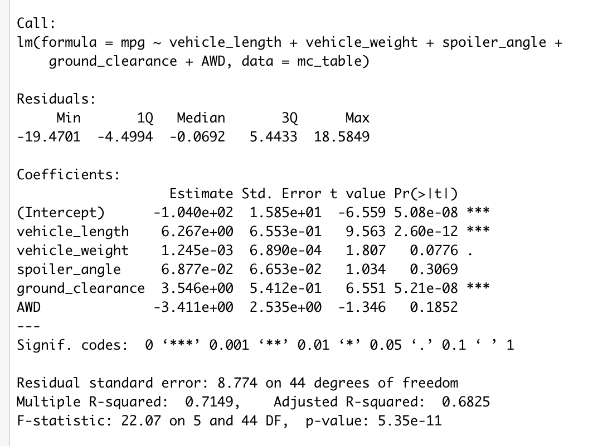
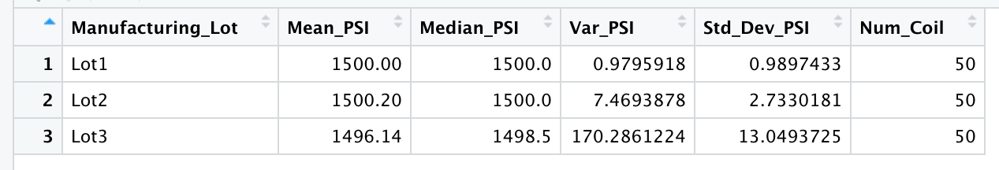

# MechaCar_Statistical_Analysis

## Linear Regression to Predict MPG

- Which variables/coefficients provided a non-random amount of variance to the mpg values in the dataset?
The three variables that had an insignificant amount of variance is vehicle weight (.0001), spoiler_angle (.07), and AWD (-3.4).
- Is the slope of the linear model considered to be zero? Why or why not?
The p-value of 5.35e-11 is less than 0.05% in a positive direction. There is sufficient evidence to reject the null hypothesis.
- Does this linear model predict mpg of MechaCar prototypes effectively? Why or why not?
Our R-squared value is 71%, which means roughly ~71% of the time the model will predict mpg values correctly. There is a 29% variance that other factors not accounted for impact the mpg analysis prediction.

## Summary Statistics on Suspension Coils

- The design specifications for the MechaCar suspension coils dictate that the variance of the suspension coils must not exceed 100 pounds per square inch. Does the current manufacturing data meet this design specification for all manufacturing lots in total and each lot individually? Why or why not?
According to the summarization of our data, the variance analysis of the suspension coils as a whole do meet the design specifications of not to exceed 100 PSI.  Looking at our summary, the variance of PSI is 62.29 and is under the requirement of 100 PSI.

Doing variance analysis on a per lot basis, we see that lot3 is over the design specifications of exceeding 100 PSI

